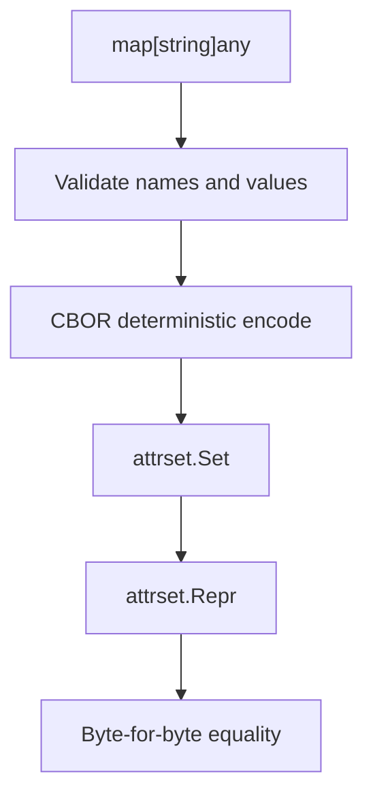
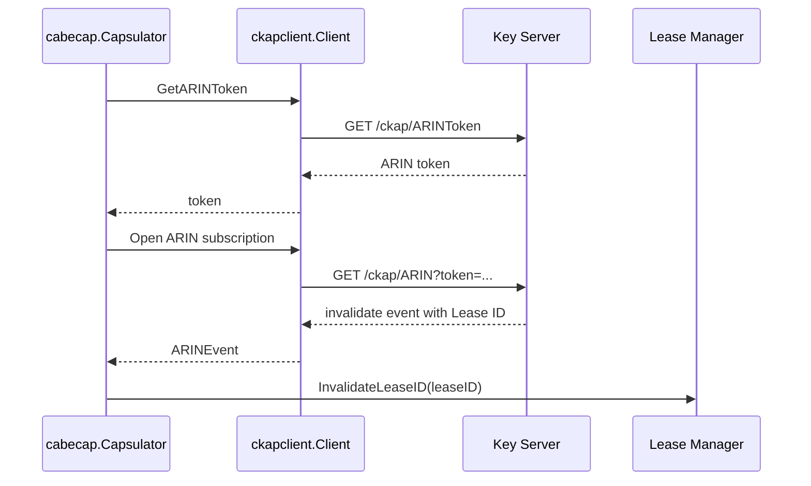
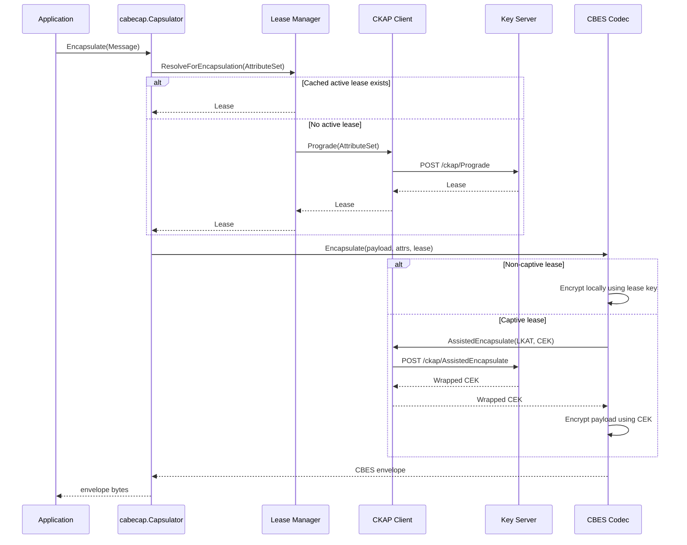
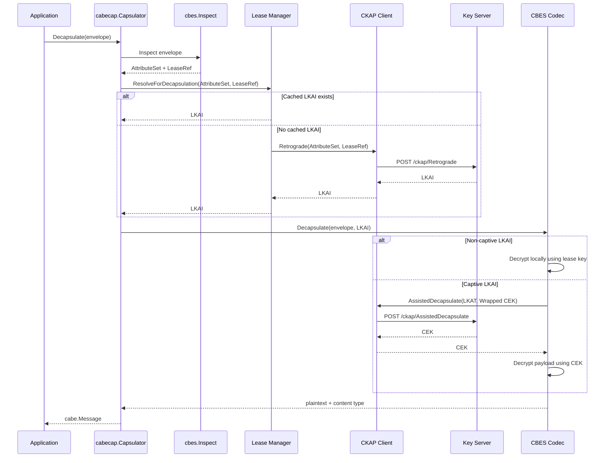
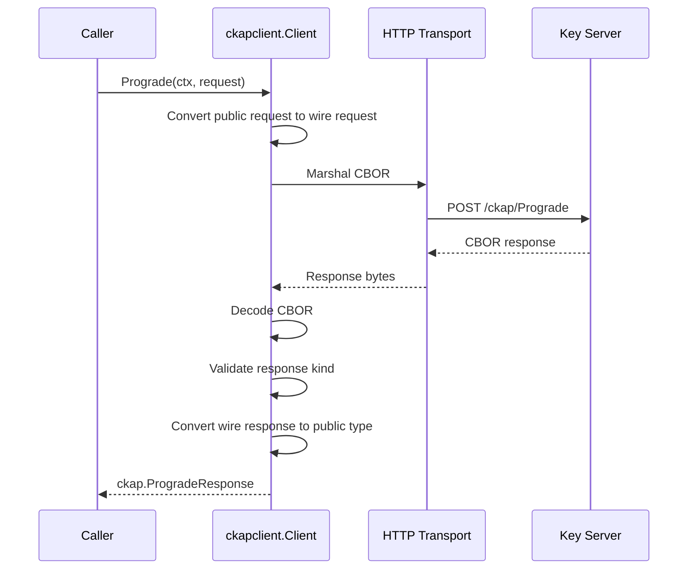
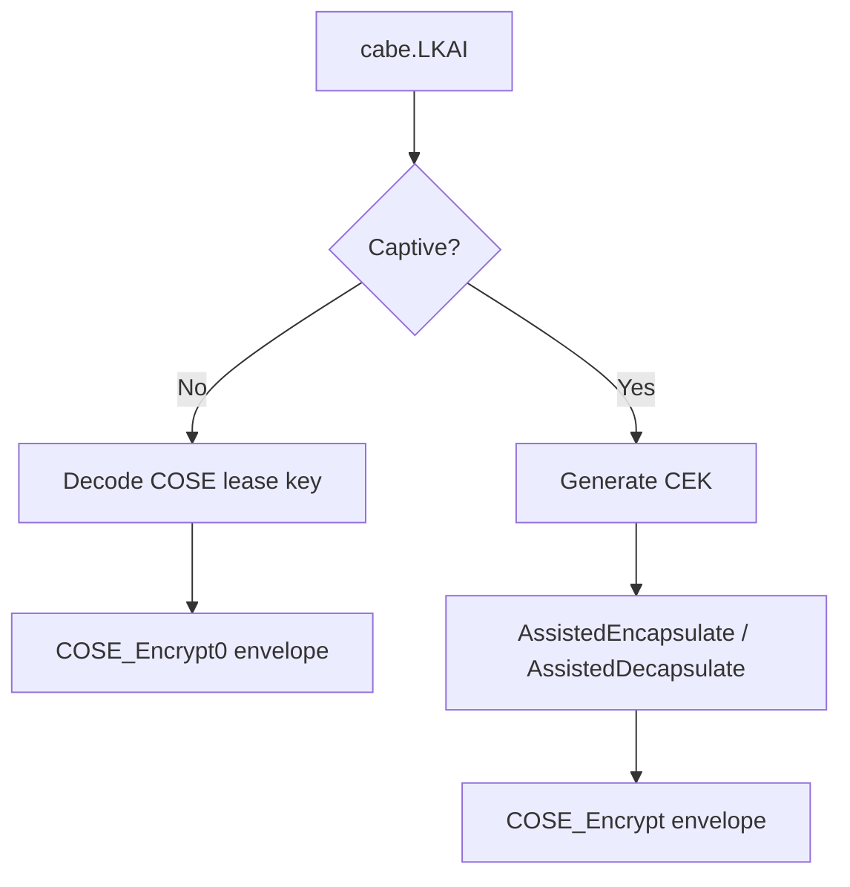

# cabe-go

[](https://pkg.go.dev/github.com/messier-42/cabe-go)
[](https://github.com/messier-42/cabe-go/actions/workflows/build.yml)

`cabe-go` is the official Go client library for [CABE](https://cabespec.org/), the Concise Attribute-Bound Encapsulation architecture.

It provides the client-side building blocks needed to:

- construct canonical CABE Attribute Sets
- call a CABE Key Server using CKAP
- encapsulate plaintext into CBES envelopes
- decapsulate CBES envelopes back into plaintext
- inspect CABE envelope metadata
- build tooling around CABE deployments

Most applications should start with the high-level `cabecap` package. Lower-level packages are available for protocol tooling, diagnostics, tests, and integrations that need direct control over CKAP operations.

---

## Table of Contents

- [Role in the CABE Architecture](#role-in-the-cabe-architecture)
- [Package Overview](#package-overview)
- [Quick Start](#quick-start)
- [Core Runtime Model](#core-runtime-model)
- [Attribute Sets](#attribute-sets)
- [High-Level Encapsulation](#high-level-encapsulation)
- [Low-Level CKAP Client](#low-level-ckap-client)
- [CBES Envelope Inspection](#cbes-envelope-inspection)
- [ARIN and Lease Invalidation](#arin-and-lease-invalidation)
- [Command-Line Tool](#command-line-tool)
- [Execution Flows](#execution-flows)
- [Internal Architecture](#internal-architecture)
- [Error Model](#error-model)
- [Security Model Summary](#security-model-summary)
- [Testing and Development](#testing-and-development)
- [Contributor Notes](#contributor-notes)
- [Known API Layers](#known-api-layers)
- [Specifications](#specifications)
- [License](#license)

---

## Role in the CABE Architecture

CABE separates application data protection from application business logic.

A CABE-aware client protects data by binding encrypted content to a CABE Attribute Set. A CABE Key Server decides, via policy, whether a caller may encapsulate or decapsulate data associated with that attribute set.

`cabe-go` provides the client-side implementation for that model.

At a high level:

```text
application message
        ↓
attribute set
        ↓
CKAP lease resolution
        ↓
CBES envelope
        ↓
encrypted CABE object
```

The Key Server remains responsible for policy decisions and lease issuance. The Go library is responsible for safe client-side construction, protocol calls, envelope encoding, envelope decoding, and developer ergonomics.

---

## Package Overview

```text
attrset/              Safe CABE Attribute Set construction and canonical encoding
cabe/                 Common public CABE types: Message, Lease, LKAI, errors, ARIN events
cabecap/              High-level managed encapsulation and decapsulation API
cbes/                 CBES envelope inspection helpers
ckap/                 Transport-independent CKAP request and response types
ckapclient/           Low-level CKAP protocol client
ckaphttp/             HTTP-specific CKAP helpers
ckapraw/              Wire-level CBOR request and response structures
cmd/cabetool/         Diagnostic CLI for CABE deployments
internal/cbescodec/   Internal CBES encap/decap codec used by cabecap
internal/leasemgr/    Internal client-side lease cache used by cabecap
```

### Which package should I use?

| Need | Package |
| --- | --- |
| Encrypt and decrypt CABE envelopes from an application | `cabecap` |
| Build or validate CABE Attribute Sets | `attrset` |
| Call CKAP operations directly | `ckapclient` |
| Work with transport-independent CKAP request/response types | `ckap` |
| Inspect envelope headers without decrypting | `cbes` |
| Build diagnostics or protocol tooling | `ckapclient`, `ckap`, `ckapraw`, `cabetool` |
| Extend internals or maintain the library | `internal/cbescodec`, `internal/leasemgr` |

Most application code should not use `ckapraw` directly. It exists to model the CBOR wire format and may change as protocol encoding details evolve.

---

## Quick Start

Go 1.25 or later is required.

```shell
go get github.com/messier-42/cabe-go
```

A typical application creates a CKAP client, wraps it in a `cabecap.Capsulator`, and then calls `Encapsulate` or `Decapsulate`.

```go
package main

import (
	"context"
	"log"
	"net/http"

	"github.com/messier-42/cabe-go/attrset"
	"github.com/messier-42/cabe-go/cabe"
	"github.com/messier-42/cabe-go/cabecap"
	"github.com/messier-42/cabe-go/ckapclient"
)

func main() {
	ctx := context.Background()

	attrs, err := attrset.New(map[string]any{
		"mission": "demo",
		"level":   int64(2),
	})
	if err != nil {
		log.Fatal(err)
	}

	c, err := cabecap.NewWithClient(ckapclient.Config{
		BaseURL:    "https://key-server.example.com/ckap/",
		HTTPClient: http.DefaultClient,
		UserAgent:  "my-app/0.1",
	})
	if err != nil {
		log.Fatal(err)
	}
	defer c.Close()

	envelope, err := c.Encapsulate(ctx, cabe.Message{
		Payload:     []byte("hello CABE"),
		Attributes:  attrs,
		ContentType: "text/plain",
	})
	if err != nil {
		log.Fatal(err)
	}

	msg, err := c.Decapsulate(ctx, envelope)
	if err != nil {
		log.Fatal(err)
	}

	log.Printf("content-type=%s payload=%s", msg.ContentType, string(msg.Payload))
}
```

Transport authentication is configured through the `http.Client` supplied to `ckapclient.Config`. For example, callers can provide an HTTP client configured for mTLS, SPIFFE, custom root CAs, proxies, or deployment-specific transport behavior.

---

## Core Runtime Model

The high-level runtime model is:

```text
Message + Attribute Set
        ↓
cabecap.Capsulator
        ↓
client-side lease cache
        ↓
ckapclient.Client
        ↓
CABE Key Server
        ↓
CBES envelope encode/decode
```

`cabecap` owns the application-facing flow. It handles lease lookup, caching, envelope construction, and assisted operations.

`ckapclient` owns direct CKAP protocol calls. It does not cache, retry normal operations, or perform envelope processing.

`attrset` and `cbes` provide safe edges around the two main CABE data structures a client must handle carefully: attribute sets and envelopes.

---

## Attribute Sets

The `attrset` package provides a safe representation of a CABE Attribute Set.

Conceptually, an Attribute Set is an unordered collection of unique name/value pairs:

```text
{
  "mission": "demo",
  "level": 2,
  "release": "coalition"
}
```

The package enforces key invariants:

- attribute names must match the CABE name grammar
- names must be unique
- values must be representable in the CBOR Basic Data Model
- serialized representations use CBOR Core Deterministic Encoding
- `Set` values are immutable, copy-safe, and concurrency-safe

A `Set` caches its canonical representation:

```go
attrs, err := attrset.New(map[string]any{
	"mission": "demo",
	"level":   int64(2),
})
if err != nil {
	return err
}

repr := attrs.Repr()
```

The canonical representation matters because CABE policy and key derivation depend on stable byte-level identity of an Attribute Set.



### Attribute Set API

Common operations:

```go
attrs.Len()
attrs.Get("mission")
attrs.Has("level")
attrs.Names()
attrs.Map()
attrs.Repr()
```

To parse a serialized attribute set:

```go
attrs, err := attrset.NewFromBytes(raw)
```

This validates both CBOR structure and deterministic encoding. Non-canonical encodings are rejected even if they decode to the same logical map.

---

## High-Level Encapsulation

The `cabecap` package provides the main application-facing API.

It exposes a managed `Capsulator` that can:

- encapsulate a `cabe.Message` into a CBES envelope
- decapsulate a CBES envelope into a `cabe.Message`
- cache leases by Attribute Set
- cache retrograde resolutions by Attribute Set and Lease Reference
- optionally subscribe to ARIN invalidation events
- support captive and non-captive lease modes

### Main API

```go
capsulator := cabecap.New(client)
```

or:

```go
capsulator, err := cabecap.NewWithClient(ckapclient.Config{
	BaseURL: "https://key-server.example.com/ckap/",
})
```

Use `New` when the caller owns the underlying `ckapclient.Client`.

Use `NewWithClient` when the `Capsulator` should create and own the client.

### Encapsulate

```go
envelope, err := capsulator.Encapsulate(ctx, cabe.Message{
	Payload:     plaintext,
	Attributes:  attrs,
	ContentType: "application/json",
})
```

The flow is:

1. obtain or reuse a lease for the message Attribute Set
2. construct a CBES envelope
3. encrypt the payload
4. embed CABE headers, including Attribute Set and Lease Reference
5. return serialized envelope bytes

### Decapsulate

```go
msg, err := capsulator.Decapsulate(ctx, envelope)
```

The flow is:

1. inspect the envelope headers
2. extract the Attribute Set and Lease Reference
3. resolve LKAI through cache or CKAP Retrograde
4. decrypt the envelope
5. return payload, attributes, and content type

### WarmLease

```go
err := capsulator.WarmLease(ctx, attrs)
```

`WarmLease` resolves a lease for an Attribute Set without encrypting data. This is useful when an application wants to pre-populate the lease cache before a latency-sensitive encapsulation path.

---

## Low-Level CKAP Client

The `ckapclient` package is a thin client for the CABE Key Access Protocol.

Each method maps directly to a CKAP operation:

```go
client.GetSelf(ctx, ckap.GetSelfRequest{})
client.Prograde(ctx, ckap.ProgradeRequest{})
client.Retrograde(ctx, ckap.RetrogradeRequest{})
client.AssistedEncapsulate(ctx, ckap.AssistedEncapsulateRequest{})
client.AssistedDecapsulate(ctx, ckap.AssistedDecapsulateRequest{})
client.GetARINToken(ctx, ckap.GetARINTokenRequest{})
```

`ckapclient.Client` is concurrency-safe. Multiple goroutines may use the same client.

It intentionally does not provide:

- lease caching
- envelope construction
- policy abstraction
- automatic non-streaming retries
- application-level encryption helpers

Those concerns live above it, primarily in `cabecap`.

### CKAP Client Construction

```go
client, err := ckapclient.NewClient(ckapclient.Config{
	BaseURL:    "https://key-server.example.com/ckap/",
	HTTPClient: http.DefaultClient,
	UserAgent:  "my-tool/0.1",
})
```

`BaseURL` is required and normalized to include a trailing slash.

`HTTPClient` is optional. If omitted, `http.DefaultClient` is used.

`UserAgent` is optional. If provided, it is prepended to the library default, producing a value such as:

```text
my-tool/0.1 cabe-go go/1.25.0 linux/amd64
```

### Error Handling

CKAP errors are represented as `*ckap.Error`.

```go
resp, err := client.Prograde(ctx, req)
if err != nil {
	var ckapErr *ckap.Error
	if errors.As(err, &ckapErr) {
		// inspect ckapErr.Code, ckapErr.Op, ckapErr.Summary, ckapErr.Details
	}
	return err
}
```

The client distinguishes:

- server-provided CKAP errors
- malformed responses
- protocol kind mismatches
- transport errors
- oversized responses

Successful CKAP responses are checked against the expected `kind` value. A mismatch is treated as a protocol error.

---

## CBES Envelope Inspection

The `cbes` package inspects CBES envelope headers without decrypting the payload.

```go
info, err := cbes.Inspect(envelope)
if err != nil {
	return err
}

fmt.Println(info.AttributeSet)
fmt.Println(info.LeaseRef)
fmt.Println(info.ContentType)
fmt.Println(info.IsCaptive)
```

`Inspect` validates the envelope shape and CABE-specific protected headers.

It returns:

- decoded Attribute Set
- Lease Reference
- content type
- captive vs non-captive envelope shape
- COSE tag
- content encryption algorithm
- protected header size
- IV or Partial IV metadata

No cryptographic verification or decryption is performed by `Inspect`.

This is useful for diagnostics, routing, logging, and deciding which CKAP operation is needed before attempting decapsulation.

---

## ARIN and Lease Invalidation

ARIN stands for Asynchronous Resolution Invalidation Notification.

In CABE, a Key Server may issue leases that are later invalidated. ARIN provides a server-to-client event stream for notifying clients that a cached lease should no longer be used.

The relevant pieces are:

- `ckapclient.GetARINToken`
- `ckapclient.Subscription`
- `cabecap` background ARIN handling
- `internal/leasemgr.Manager` lease invalidation by Lease ID

By default, `cabecap` attempts to use ARIN. If the Key Server reports that ARIN is unsupported, the `Capsulator` logs a warning and continues without invalidation events.

ARIN can be disabled explicitly:

```go
capsulator := cabecap.New(client, cabecap.WithARIN(false))
```

When disabled, cached leases are kept until expiry or local eviction.



---

## Command-Line Tool

The repository includes `cabetool`, a diagnostic CLI for CABE deployments.

It supports:

- `whoami` — call CKAP `GetSelf`
- `encap` — encapsulate plaintext into a CBES envelope
- `decap` — decapsulate a CBES envelope into plaintext

Example:

```shell
cabetool \
  --base-url https://key-server.example.com/ckap/ \
  whoami
```

Encapsulation:

```shell
echo "hello CABE" | cabetool \
  --base-url https://key-server.example.com/ckap/ \
  encap \
  -A mission=str:demo \
  -A level=int:2 \
  --content-type text/plain \
  --out message.cbes
```

Decapsulation:

```shell
cabetool \
  --base-url https://key-server.example.com/ckap/ \
  decap \
  --in message.cbes \
  --out plaintext.txt \
  --meta-out metadata.yaml
```

### Authentication Modes

`cabetool` supports several transport authentication modes:

| Mode | Configuration |
| --- | --- |
| Anonymous / server-auth only | `--base-url`, optional `--ca-cert` |
| File-based mTLS | `--client-cert`, `--client-key`, optional `--ca-cert` |
| SPIFFE mTLS | `--spiffe-socket`, `--server-spiffe-id-regex` |

Environment variables are also supported:

```text
CABE_BASE_URL
CABE_CA_CERT
CABE_CLIENT_CERT
CABE_CLIENT_KEY
SPIFFE_ENDPOINT_SOCKET
CABE_SERVER_SPIFFE_ID_REGEX
CABE_TIMEOUT
CABE_LOG_FORMAT
CABE_LOG_SEVERITY
```

---

## Execution Flows

### Encapsulation Flow



---

### Decapsulation Flow



---

### Raw CKAP Client Flow



---

## Internal Architecture

### `cabecap`

`cabecap` is the managed application-facing layer.

It owns:

- high-level `Encapsulate`
- high-level `Decapsulate`
- `WarmLease`
- optional ARIN stream lifecycle
- integration with the lease manager
- integration with the internal CBES codec

It deliberately keeps application code away from wire-level CKAP details.

### `internal/leasemgr`

The lease manager provides two caches:

```text
Attribute Set Repr → active Lease
(Attribute Set Repr, LeaseRef) → LKAI
```

The first cache supports encapsulation. If an active lease exists for an Attribute Set, it can be reused until it expires or is invalidated.

The second cache supports decapsulation. If the client has already resolved the LKAI for a given envelope Attribute Set and Lease Reference, it can avoid a repeated Retrograde call.

The manager is concurrency-safe.

It also maintains a `LeaseID → Attribute Set Repr` map so ARIN invalidation events can evict the corresponding active lease.

### `internal/cbescodec`

The internal CBES codec performs envelope encryption and decryption.

For non-captive leases:

- the lease key is delivered to the client as a COSE key
- the codec builds a COSE `Encrypt0` envelope
- encryption and decryption are local

For captive leases:

- the client receives an LKAT, not the lease key
- the codec generates a content encryption key
- the Key Server wraps or unwraps that CEK using assisted CKAP operations
- the codec builds or decrypts a COSE `Encrypt` envelope

This split lets the library support both normal client-side operation and deployments where lease keys must remain inside the Key Server boundary.



### `ckap`

The `ckap` package defines transport-independent request and response types.

These types are intended for normal Go code that needs direct CKAP access without dealing with CBOR wire structures.

### `ckapraw`

The `ckapraw` package defines wire-level CBOR request and response structures.

It is intentionally lower-level. It exists so the transport layer can:

- marshal and unmarshal CKAP messages
- preserve raw Attribute Set bytes long enough to classify errors correctly
- validate `kind` discriminators
- convert wire-level responses into public CABE types

Most applications should not use `ckapraw`.

### `ckaphttp`

The `ckaphttp` package currently provides HTTP-specific helpers, especially writing CKAP error responses as CBOR over HTTP.

### `cbes`

The public `cbes` package provides envelope inspection.

It currently does not expose full public encap/decap functions. High-level encryption and decryption are available through `cabecap`, which uses `internal/cbescodec`.

---

## Error Model

The main structured protocol error type is:

```go
type Error struct {
	Code    cabe.Code
	Summary string
	Details map[string]any
	Op      string
	Err     error
}
```

Errors from CKAP operations can be inspected with `errors.As`.

```go
var e *ckap.Error
if errors.As(err, &e) {
	switch e.Code {
	case cabe.CodeUnauthorized:
		// authentication failed
	case cabe.CodePolicyDenied:
		// policy denied access
	case cabe.CodeInvalidRef:
		// bad or unrecognized lease reference
	}
}
```

The baseline CABE error codes are defined in the `cabe` package.

---

## Security Model Summary

The library is designed around a few boundaries:

- Attribute Sets are canonicalized before use
- Attribute Set representations are byte-stable
- CKAP responses are checked for expected operation kind
- response bodies are size-limited
- lease keys are cached only client-side and only when provided in non-captive mode
- captive mode avoids exposing lease keys to the client
- ARIN can invalidate cached leases before expiry
- transport security is delegated to the configured `http.Client`

Applications are responsible for configuring the HTTP client appropriately for their deployment, including TLS, mTLS, SPIFFE, custom roots, or proxy settings.

---

## Testing and Development

Build:

```shell
make build
```

Run tests:

```shell
make test
```

Run tests with the race detector:

```shell
make test-race
```

Run coverage:

```shell
make cover
```

Run `go vet`:

```shell
make vet
```

Run formatting:

```shell
make fmt
```

Check formatting without modifying files:

```shell
make fmt-check
```

Run linting:

```shell
make lint
```

Generate an SBOM:

```shell
make sbom
```

Scan dependencies with Grype:

```shell
make grype
```

---

## Contributor Notes

The most important mental model for contributors is:

```text
attributes → lease resolution → envelope operation
```

For encapsulation:

```text
Message
  → Attribute Set Repr
  → Prograde lease resolution
  → CBES envelope construction
```

For decapsulation:

```text
CBES envelope
  → header inspection
  → Retrograde LKAI resolution
  → payload recovery
```

When changing the codebase, preserve the separation between:

- canonical Attribute Set handling
- public CABE domain types
- CKAP protocol types
- raw CKAP wire structs
- high-level encapsulation and decapsulation
- internal lease caching
- internal CBES codec behavior
- command-line diagnostics

That separation is what keeps the library usable both as an application SDK and as a protocol-conformance tool.

### Useful starting points

| Task | Start here |
| --- | --- |
| Understand high-level application behavior | `cabecap/capsulator.go` |
| Understand Attribute Set validation | `attrset/attrset.go` |
| Understand raw CKAP operations | `ckapclient/methods.go` |
| Understand HTTP transport behavior | `ckapclient/transport.go` |
| Understand lease caching | `internal/leasemgr/manager.go` |
| Understand envelope construction | `internal/cbescodec/codec.go` |
| Understand envelope metadata parsing | `cbes/inspect.go` |
| Understand CLI behavior | `cmd/cabetool/` |

### Maintainer notes

A few implementation details are worth preserving:

- `attrset.Set` is immutable by construction.
- `attrset.Repr` equality is byte-for-byte equality over deterministic CBOR.
- `ckapraw.AttrSet` intentionally defers Attribute Set parsing so transports can classify request errors correctly.
- `ckapclient.Client` is intentionally thin and does not cache.
- `cabecap.Capsulator` owns the higher-level lease cache and ARIN behavior.
- `internal/leasemgr.Manager` caches both Prograde and Retrograde results.
- `internal/cbescodec` supports both non-captive and captive envelope paths.
- `cbes.Inspect` performs structural inspection, not decryption or authentication.

---

## Known API Layers

The library has three conceptual API layers.

```text
Application layer:
  cabecap
  cabe
  attrset
  cbes

Protocol layer:
  ckap
  ckapclient
  ckaphttp

Wire/internal layer:
  ckapraw
  internal/cbescodec
  internal/leasemgr
```

Use the highest-level package that fits the job.

If application code is importing `ckapraw` or `internal` packages, it is probably bypassing the intended abstraction boundary.

---

## Specifications

The CABE specifications define the architecture, envelope format, and key access protocol implemented by this library:

- [CABE Architecture](https://cabespec.org/spec/arch/)
- [CABE Baseline Envelope Structure (CBES)](https://cabespec.org/spec/cbes/)
- [CABE Key Access Protocol (CKAP)](https://cabespec.org/spec/ckap/)
- [CABE specification site](https://cabespec.org/)

---

## License

This repository is licensed under the [Apache 2.0 license](doc/COPYING).
